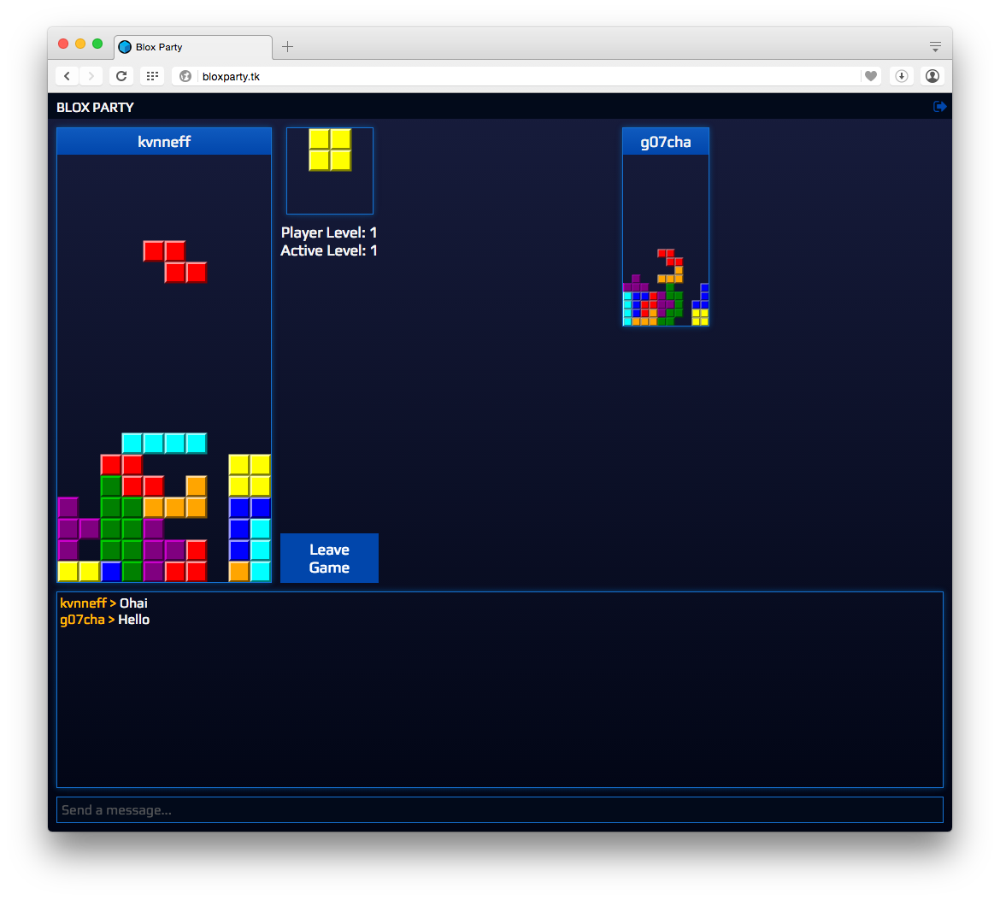

# Blox Party 

A multiplayer Tetris game built with [Electron](http://electron.atom.io/).

[Download the latest release](https://github.com/kvnneff/bloxparty/releases) or [play through your browser](http://bloxparty.tk/play/)!

A [Blox Party server](https://github.com/kvnneff/bloxparty-server) is required to host games.

List of public servers:

- `bloxparty-server.kvnneff.me`

This game is meant to eventually be a clone of [TetriNET](http://tetrinet.info/).

## Game Mechanics

Each game room can support up to six players, with the first player having the ability to start the game.

Send garbage lines to your opponents when you clear lines:

* Clear 2 lines, add 1 garbage line to all opponents
* Clear 3 lines, add 2 garbage lines to all opponents
* Clear 4 lines, add 4 garbage lines to all opponents

## See Also

* [bloxparty-server](https://github.com/kvnneff/bloxparty-server): Server for hosting games
* [bloxparty-board](https://github.com/kvnneff/bloxparty-board): Core game logic

## Dev

**Commands:**

* Init: `npm install`
* Run: `npm start`
* Build JS & CSS: `npm run build-ui`
* Build App: `npm run build`
* Create installers: `npm run release`

## Contributors

* [Kevin Neff](https://github.com/kvnneff)
* [Konstantin Azizov](https://github.com/G07cha)
* Anonymous (thanks for the logo!)

## License

MIT
